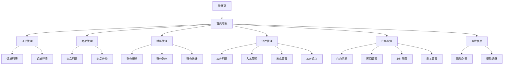

## 1. 产品概述

KTV商户后台管理系统，为KTV门店提供完整的订单、商品、财务、仓库等管理功能。帮助商户高效管理门店运营，提升服务质量和管理效率。

目标用户：KTV门店经营者、店员、仓库管理员、财务人员。

## 2. 核心功能

### 2.1 用户角色

| 角色    | 注册方式 | 核心权限          |
| ----- | ---- | ------------- |
| 店长    | 后台创建 | 全权限，可查看所有模块数据 |
| 店员    | 店长创建 | 订单管理、商品管理     |
| 仓库管理员 | 店长创建 | 仓库管理、商品库存管理   |
| 财务人员  | 店长创建 | 财务管理、数据导出     |

### 2.2 功能模块

系统包含以下7个核心模块：

1. **首页看板**：今日销售数据、待接单、配送中、退款中快捷入口
2. **订单管理**：实时订单列表/详情、房间座位展示、状态流转管理
3. **商品管理**：分类管理、商品信息、上下架、价格库存管理
4. **退款售后**：退款申请处理、部分退款、退款记录查询
5. **财务管理**：支付流水、退款流水、日结统计、数据导出
6. **仓库管理**：入库出库、库存查询、盘点、低库存预警
7. **门店设置**：门店资料、房间座位管理、微信支付配置、员工账号权限

### 2.3 页面详情

| 页面名称  | 模块名称  | 功能描述                        |
| ----- | ----- | --------------------------- |
| 登录页   | 用户登录  | 输入账号密码登录系统                  |
| 首页看板  | 数据概览  | 显示今日销售额、订单数、待接单数、配送中数、退款中数  |
| 首页看板  | 快捷入口  | 待接单、配送中、退款中快速跳转按钮           |
| 订单列表  | 订单展示  | 实时显示订单列表，包含订单号、房间号、金额、状态、时间 |
| 订单列表  | 搜索筛选  | 按订单号、房间号、状态、时间范围筛选          |
| 订单详情  | 订单信息  | 显示订单详情、商品清单、客户信息、订单状态       |
| 订单详情  | 状态操作  | 接单→配送中→送达/完成/异常的状态流转操作      |
| 商品列表  | 商品展示  | 显示商品列表，包含名称、分类、价格、库存、状态     |
| 商品列表  | 商品操作  | 商品上下架、价格修改、库存调整             |
| 商品分类  | 分类管理  | 商品分类的增删改查                   |
| 退款列表  | 退款申请  | 显示用户退款申请列表，包含订单号、退款金额、申请时间  |
| 退款列表  | 退款处理  | 审核退款申请，支持部分退款按订单项处理         |
| 退款记录  | 记录查询  | 查询历史退款记录                    |
| 财务概览  | 数据概览  | 显示今日收入、支出、订单数等财务数据          |
| 财务流水  | 收支明细  | 显示支付流水、退款流水明细               |
| 财务统计  | 日结统计  | 按日期统计收入、支出、订单量              |
| 财务导出  | 数据导出  | 导出财务数据为Excel文件              |
| 仓库概览  | 库存概览  | 显示商品库存总量、低库存预警数量            |
| 库存列表  | 库存查询  | 按商品查询库存数量、入库时间、出库时间         |
| 入库管理  | 入库操作  | 记录商品入库信息，包含数量、时间、操作人        |
| 出库管理  | 出库操作  | 记录商品出库信息，包含数量、时间、操作人        |
| 库存盘点  | 盘点功能  | 盘点库存数量，记录盘点差异               |
| 低库存预警 | 预警设置  | 设置商品最低库存预警值，库存不足时提醒         |
| 门店信息  | 基本信息  | 设置门店名称、地址、电话、营业时间等基本信息      |
| 房间管理  | 房间设置  | 管理房间/座位信息，包含房间号、类型、容纳人数     |
| 二维码管理 | 二维码生成 | 为每个房间生成点单二维码                |
| 支付配置  | 微信支付  | 配置微信商户号支付参数，包含校验配置功能        |
| 员工管理  | 账号管理  | 添加、编辑、删除员工账号                |
| 权限管理  | 角色权限  | 设置员工角色和对应权限                 |

## 3. 核心流程

### 店长操作流程

1. 登录系统 → 查看首页看板数据 → 进入订单管理处理待接单 → 商品管理维护商品信息 → 财务管理查看收支情况 → 仓库管理查看库存 → 门店设置配置基础信息

### 店员操作流程

1. 登录系统 → 查看首页看板 → 订单管理处理订单（接单→配送→完成）→ 商品管理查看商品库存

### 财务人员操作流程

1. 登录系统 → 财务管理查看流水 → 日结统计 → 数据导出

### 仓库管理员操作流程

1. 登录系统 → 仓库管理 → 入库/出库操作 → 库存盘点 → 低库存预警处理

## 4. 用户界面设计

### 4.1 设计风格

* **主色调**：深蓝色 (#1890ff) 为主，白色背景

* **辅助色**：绿色 (#52c41a) 表示成功，红色 (#ff4d4f) 表示警告/错误

* **按钮样式**：圆角矩形，主要按钮使用主色调

* **字体**：系统默认字体，主要文字 14px，标题 16-18px

* **布局风格**：左侧边栏导航 + 顶部栏 + 内容区域

* **图标风格**：使用线性图标，简洁明了

### 4.2 页面设计概述

| 页面名称 | 模块名称 | UI元素                              |
| ---- | ---- | --------------------------------- |
| 登录页  | 登录表单 | 居中卡片布局，包含logo、账号密码输入框、登录按钮，背景渐变蓝色 |
| 首页看板 | 数据卡片 | 四个数据卡片横向排列，显示今日销售等关键数据，使用数字大字体展示  |
| 首页看板 | 快捷入口 | 三个快捷按钮，使用图标+文字，点击跳转到对应模块          |
| 订单列表 | 列表展示 | 表格形式展示订单数据，包含状态标签（不同颜色区分状态）       |
| 订单列表 | 搜索区域 | 顶部搜索栏，包含输入框和筛选条件，支持多条件组合搜索        |
| 订单详情 | 详情抽屉 | 右侧滑出抽屉，分区域展示订单信息、商品清单、操作记录        |
| 商品列表 | 商品卡片 | 卡片式布局展示商品，包含商品图片、名称、价格、库存、操作按钮    |
| 商品分类 | 分类树  | 树形结构展示商品分类，支持拖拽排序                 |
| 财务管理 | 数据图表 | 使用图表展示收支趋势，支持按日期筛选                |
| 仓库管理 | 库存表格 | 表格展示库存数据，低库存行标红显示                 |
| 门店设置 | 设置表单 | 分组表单展示不同设置项，包含输入框、开关、按钮等控件        |

### 4.3 响应式设计

* **桌面端优先**：主要面向桌面端使用，优化大屏幕显示效果

* **平板适配**：支持平板设备，侧边栏可收起展开

* **移动端兼容**：基础功能支持移动端访问，简化操作流程

### 4.4 交互设计

* **加载状态**：数据加载显示骨架屏，操作按钮显示加载中状态

* **反馈提示**：操作成功/失败显示消息提示，重要操作需要确认

* **表单验证**：实时表单验证，错误提示明确

* **数据刷新**：关键数据支持手动刷新和自动刷新

