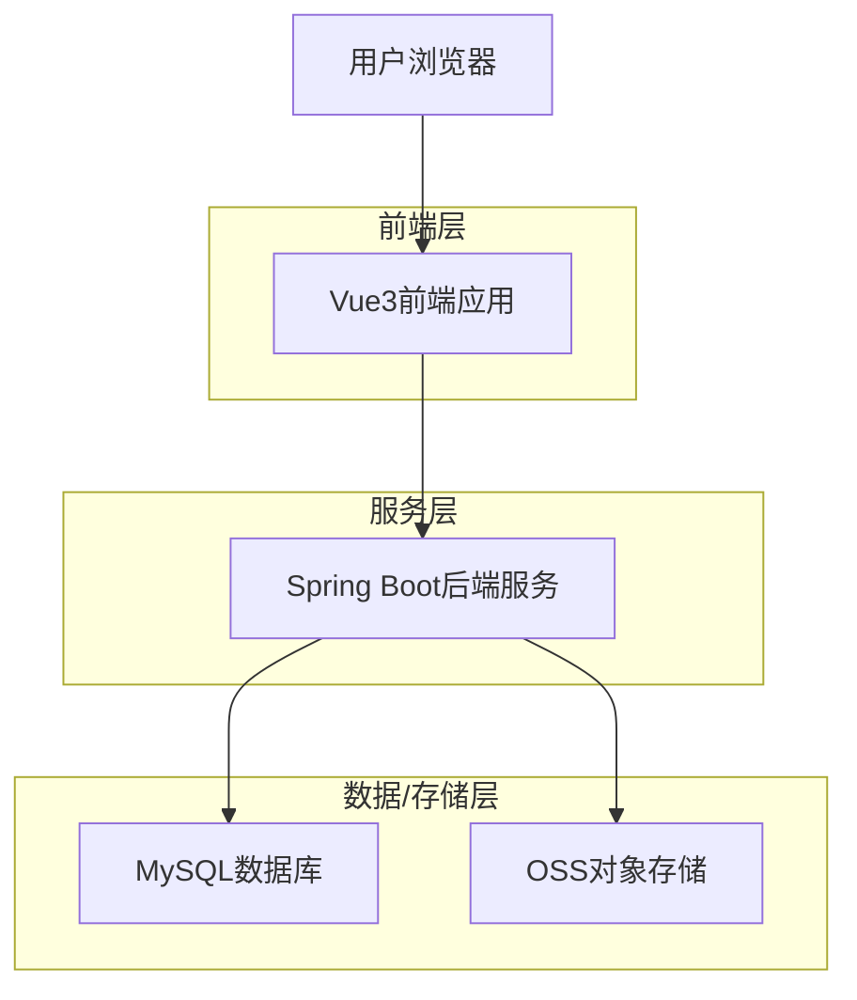
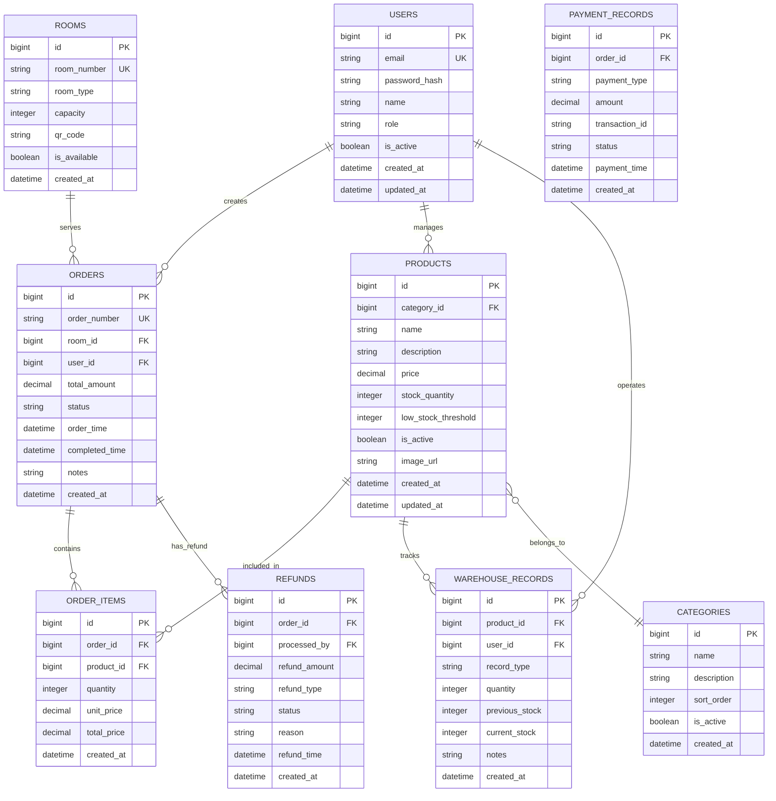

## 1. 架构设计



## 2. 技术描述

* **前端框架**：Vue3\@3.4 + Vite\@5.0 + JavaScript

* **初始化工具**：Vite-init

* **UI组件库**：Element Plus\@2.4（饿了么Vue3组件库）

* **状态管理**：Pinia\@2.1（Vue3官方推荐）

* **路由管理**：Vue Router\@4.2

* **CSS框架**：Tailwind CSS\@3.4

* **图标库**：@element-plus/icons-vue

* **图表库**：ECharts\@5.4（数据可视化）

* **二维码生成**：qrcode\@1.5

* **Excel导出**：xlsx\@0.18

* **后端服务**：Spring Boot (规划中，暂不实现)

* **数据库**：MySQL (规划中，暂不实现)

* **存储**：OSS (规划中，暂不实现)

## 3. 路由定义

| 路由                    | 用途              |
| --------------------- | --------------- |
| /login                | 登录页面，用户身份验证     |
| /dashboard            | 首页看板，显示核心数据指标   |
| /orders               | 订单列表页面，管理所有订单   |
| /orders/:id           | 订单详情页面，查看订单详细信息 |
| /products             | 商品列表页面，管理商品信息   |
| /products/categories  | 商品分类管理页面        |
| /refunds              | 退款管理页面，处理退款申请   |
| /finance              | 财务管理页面，查看收支情况   |
| /warehouse            | 仓库管理页面，管理库存     |
| /warehouse/stock      | 库存查询页面          |
| /warehouse/inbound    | 入库管理页面          |
| /warehouse/outbound   | 出库管理页面          |
| /warehouse/inventory  | 库存盘点页面          |
| /settings             | 门店设置主页面         |
| /settings/store       | 门店基本信息设置        |
| /settings/rooms       | 房间座位管理页面        |
| /settings/payment     | 支付配置页面          |
| /settings/staff       | 员工管理页面          |
| /settings/permissions | 权限管理页面          |

## 4. 数据模型定义 (逻辑模型)



## 5. 组件架构

### 5.1 布局组件

* **AppLayout**：主布局组件，包含侧边栏、顶部栏、内容区域

* **Sidebar**：侧边栏导航组件，支持菜单收起展开

* **Header**：顶部栏组件，包含用户信息、通知等

* **Content**：内容区域组件，包含面包屑导航

### 5.2 通用组件

* **DataTable**：数据表格组件，支持排序、筛选、分页

* **SearchForm**：搜索表单组件，支持多条件组合搜索

* **DetailDrawer**：详情抽屉组件，右侧滑出展示详情

* **FormModal**：表单弹窗组件，用于新增/编辑操作

* **StatusTag**：状态标签组件，不同状态显示不同颜色

* **ChartCard**：图表卡片组件，用于数据可视化展示

### 5.3 业务组件

* **OrderList**：订单列表组件，展示订单核心信息

* **OrderDetail**：订单详情组件，展示完整订单信息

* **ProductCard**：商品卡片组件，卡片式展示商品

* **StockAlert**：库存预警组件，低库存时显示警告

* **QRCodeGenerator**：二维码生成组件，为房间生成点单二维码

* **FinanceChart**：财务图表组件，展示收支趋势

## 6. 开发规范

### 6.1 代码规范

* 使用TypeScript进行类型约束

* 组件使用Composition API编写

* 统一使用Element Plus组件库

* 遵循Vue3官方风格指南

### 6.2 文件结构

```
src/
├── api/          # API接口定义 (Mock或对接Spring Boot)
├── assets/       # 静态资源
├── components/   # 通用组件
├── composables/  # 组合式函数
├── layouts/      # 布局组件
├── router/       # 路由配置
├── stores/       # Pinia状态管理
├── utils/        # 工具函数
├── views/        # 页面组件
└── lib/          # 工具库
```

## 7. 后端开发指南 (Spring Boot + MySQL + OSS)

### 7.1 开发环境准备

* **JDK**: 推荐 JDK 17 或 21 (LTS)

* **Database**: MySQL 8.0

* **Build Tool**: Maven 或 Gradle (推荐 Maven 3.6+)

* **IDE**: IntelliJ IDEA (推荐)

### 7.2 技术栈详细规划

* **Web 框架**: Spring Boot 3.x

* **ORM 框架**: MyBatis-Plus (推荐，开发效率高) 或 Spring Data JPA

* **数据库连接池**: Druid 或 HikariCP

* **权限认证**: Spring Security + JWT (jjwt)

* **对象存储**: Aliyun OSS SDK / MinIO / Tencent COS (按需选择)

* **工具库**: Hutool, Lombok, Fastjson2/Jackson

### 7.3 后端项目结构建议

```
com.ktv.backend
├── common          # 通用模块 (Result, Exception, Utils)
├── config          # 配置类 (WebMvc, Swagger, Security, MyBatis)
├── controller      # 控制层 (API 接口)
├── entity          # 实体类 (对应数据库表)
├── mapper          # 数据访问层 (DAO)
├── service         # 业务逻辑层接口
│   └── impl        # 业务逻辑层实现
└── dto             # 数据传输对象 (Request/Response)
```

### 7.4 开发步骤路线图

#### 第一阶段：基础设施搭建

1. **数据库初始化**：根据逻辑模型创建物理表（参考本文档第4节）。
2. **Spring Boot 初始化**：使用 Spring Initializr 创建项目，引入 Web, MySQL, MyBatis-Plus, Lombok 依赖。
3. **统一响应封装**：创建 `Result<T>` 类，规范返回格式 `{code: 200, msg: "success", data: ...}`。
4. **全局异常处理**：使用 `@RestControllerAdvice` 处理业务异常和系统异常。

#### 第二阶段：核心模块开发

1. **用户认证模块 (Auth)**：

   * 实现登录接口 `/api/auth/login`。

   * 集成 JWT，生成 Token。

   * 配置拦截器或 Filter 校验 Token。
2. **商品模块 (Product)**：

   * 商品分类 CRUD。

   * 商品管理 CRUD。

   * **OSS 图片上传**：实现 `/api/upload` 接口，对接 OSS 服务，返回图片 URL。
3. **订单模块 (Order)**：

   * 订单创建（关联房间、商品）。

   * 状态流转（待接单 -> 配送中 -> 完成）。

   * 订单查询与筛选。

#### 第三阶段：进阶功能与联调

1. **Websocket (可选)**：实现实时订单提醒（新订单语音播报）。
2. **报表统计**：编写 SQL 聚合查询，统计每日营收。
3. **前后端联调**：

   * 前端配置 `axios` 的 `baseURL` 指向后端地址。

   * 替换前端 Mock 数据为真实 API 调用。

### 7.5 接口设计规范 (RESTful)

* `GET /api/products` - 获取商品列表

* `GET /api/products/{id}` - 获取商品详情

* `POST /api/products` - 新增商品

* `PUT /api/products` - 修改商品

* `DELETE /api/products/{id}` - 删除商品

