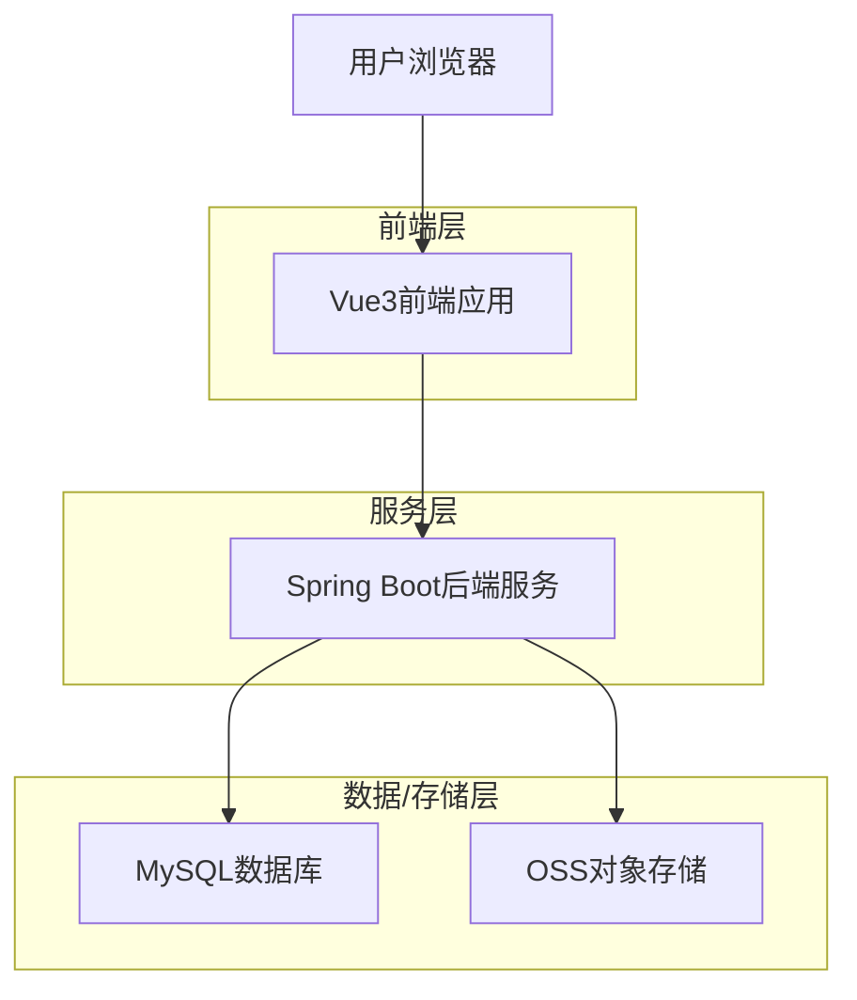
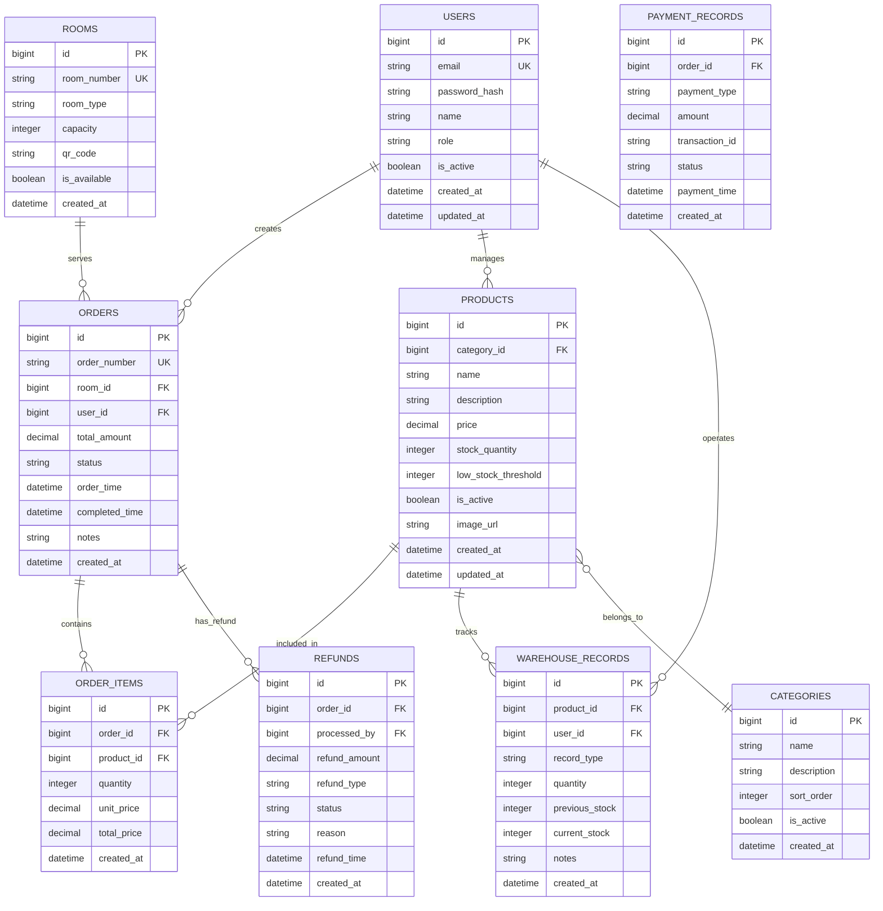

## 1. 架构设计



## 2. 技术描述

- **前端框架**：Vue3@3.4 + Vite@5.0 + TypeScript@5.0
- **初始化工具**：Vite-init
- **UI组件库**：Element Plus@2.4（饿了么Vue3组件库）
- **状态管理**：Pinia@2.1（Vue3官方推荐）
- **路由管理**：Vue Router@4.2
- **CSS框架**：Tailwind CSS@3.4
- **图标库**：@element-plus/icons-vue
- **图表库**：ECharts@5.4（数据可视化）
- **二维码生成**：qrcode@1.5
- **Excel导出**：xlsx@0.18
- **后端服务**：Spring Boot (规划中，暂不实现)
- **数据库**：MySQL (规划中，暂不实现)
- **存储**：OSS (规划中，暂不实现)

## 3. 路由定义

| 路由 | 用途 |
|------|------|
| /login | 登录页面，用户身份验证 |
| /dashboard | 首页看板，显示核心数据指标 |
| /orders | 订单列表页面，管理所有订单 |
| /orders/:id | 订单详情页面，查看订单详细信息 |
| /products | 商品列表页面，管理商品信息 |
| /products/categories | 商品分类管理页面 |
| /refunds | 退款管理页面，处理退款申请 |
| /finance | 财务管理页面，查看收支情况 |
| /warehouse | 仓库管理页面，管理库存 |
| /warehouse/stock | 库存查询页面 |
| /warehouse/inbound | 入库管理页面 |
| /warehouse/outbound | 出库管理页面 |
| /warehouse/inventory | 库存盘点页面 |
| /settings | 门店设置主页面 |
| /settings/store | 门店基本信息设置 |
| /settings/rooms | 房间座位管理页面 |
| /settings/payment | 支付配置页面 |
| /settings/staff | 员工管理页面 |
| /settings/permissions | 权限管理页面 |

## 4. 数据模型定义 (逻辑模型)



## 5. 组件架构

### 5.1 布局组件
- **AppLayout**：主布局组件，包含侧边栏、顶部栏、内容区域
- **Sidebar**：侧边栏导航组件，支持菜单收起展开
- **Header**：顶部栏组件，包含用户信息、通知等
- **Content**：内容区域组件，包含面包屑导航

### 5.2 通用组件
- **DataTable**：数据表格组件，支持排序、筛选、分页
- **SearchForm**：搜索表单组件，支持多条件组合搜索
- **DetailDrawer**：详情抽屉组件，右侧滑出展示详情
- **FormModal**：表单弹窗组件，用于新增/编辑操作
- **StatusTag**：状态标签组件，不同状态显示不同颜色
- **ChartCard**：图表卡片组件，用于数据可视化展示

### 5.3 业务组件
- **OrderList**：订单列表组件，展示订单核心信息
- **OrderDetail**：订单详情组件，展示完整订单信息
- **ProductCard**：商品卡片组件，卡片式展示商品
- **StockAlert**：库存预警组件，低库存时显示警告
- **QRCodeGenerator**：二维码生成组件，为房间生成点单二维码
- **FinanceChart**：财务图表组件，展示收支趋势

## 6. 开发规范

### 6.1 代码规范
- 使用TypeScript进行类型约束
- 组件使用Composition API编写
- 统一使用Element Plus组件库
- 遵循Vue3官方风格指南

### 6.2 文件结构
```
src/
├── api/          # API接口定义 (Mock或对接Spring Boot)
├── assets/       # 静态资源
├── components/   # 通用组件
├── composables/  # 组合式函数
├── layouts/      # 布局组件
├── router/       # 路由配置
├── stores/       # Pinia状态管理
├── utils/        # 工具函数
├── views/        # 页面组件
└── types/        # TypeScript类型定义
```
